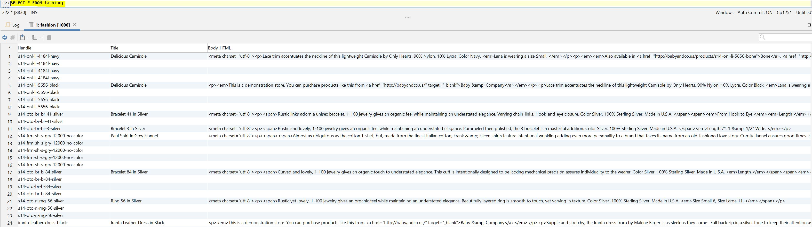
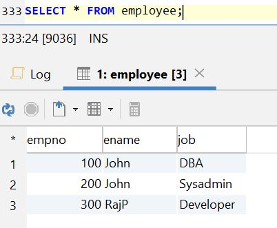

<h1 align="center">ДЗ 13</h1>
<h1 align="center">MySQL transaction</h1>

---
### Create table ###
```sql
--Создал 2 таблицы для теста
CREATE TABLE users1 (
  id MEDIUMINT(8) UNSIGNED NOT NULL AUTO_INCREMENT,
  name VARCHAR(200) NOT NULL,
  surname VARCHAR(200) NOT NULL,
  age INT NOT NULL,
  PRIMARY KEY (id)
) ENGINE=INNODB;

CREATE TABLE users2 (
  id MEDIUMINT(8) UNSIGNED NOT NULL AUTO_INCREMENT,
  name VARCHAR(200) NOT NULL,
  surname VARCHAR(200) NOT NULL,
  age INT NOT NULL,
  PRIMARY KEY (id)
) ENGINE=INNODB;
```

### Create procedure (вставляет строки в таблицу/ы в рамках транзакции) ###
```sql
-- numlines - кол-во строк, tableName - имя таблицы в которую хотим добавить эти строки
DELIMITER //
CREATE PROCEDURE modifytable(
    IN numlines INT,
    IN tableName VARCHAR(64)
)
BEGIN
    DECLARE errno INT;
    DECLARE i INT DEFAULT 0;
    DECLARE a,b VARCHAR(11);
    DECLARE EXIT HANDLER FOR SQLEXCEPTION
    BEGIN
      GET CURRENT DIAGNOSTICS CONDITION 1 errno = MYSQL_ERRNO;
      SELECT errno AS MYSQL_ERROR;
      ROLLBACK;
    END;

    START TRANSACTION;
      while (i<numlines) do
        SELECT CHAR(65+rand()*26,65+rand()*26,65+rand()*26,65+rand()*26 USING utf8)INTO a;
        SELECT CHAR(65+rand()*26,65+rand()*26,65+rand()*26,65+rand()*26 USING utf8)INTO b;
        SET @t1 =CONCAT('INSERT INTO ',tableName,' (name, surname, age) VALUES (\'',a,''',', '\'',b,'\', rand()*100);');
        PREPARE stmt3 FROM @t1;
        EXECUTE stmt3;
        DEALLOCATE PREPARE stmt3;
        set i=i+1;
      end while;
    COMMIT WORK;
END
//
--добавляем 50 строк в таблицу, если будет ошибка в процессе вставки, то будет выполнен rollback, а код ошибки будет выведен оператору
CALL filltable (50, 'users1');
CALL filltable (50, 'users2');
```
### LOAD DATA ###
```sql
SHOW VARIABLES LIKE "secure_file_priv";
```
В my.cnf добавил secure-file-priv=/etc/mysql/conf.d

mysql -u root -p

use otus
```sql
--Создаем таблицу
CREATE TABLE fashion (
Handle VARCHAR(255),
Title VARCHAR(255),
Body_HTML_ TEXT,
Vendor VARCHAR(255),
Type VARCHAR(255),
Tags VARCHAR(255),
Published VARCHAR(255),
Option1_Name VARCHAR(255),
Option1_Value VARCHAR(255),
Option2_Name VARCHAR(255),
Option2_Value VARCHAR(255),
Option3_Name VARCHAR(255),
Option3_Value VARCHAR(255),
Variant_SKU VARCHAR(255),
Variant_Grams VARCHAR(255),
Variant_Inventory_Tracker VARCHAR(255),
Variant_Inventory_Qty VARCHAR(255),
Variant_Inventory_Policy VARCHAR(255),
Variant_Fulfillment_Service VARCHAR(255),
Variant_Price VARCHAR(255),
Variant_Compare_At_Price VARCHAR(255),
Variant_Requires_Shipping VARCHAR(255),
Variant_Taxable VARCHAR(255),
Variant_Barcode VARCHAR(255),
Image_Src VARCHAR(255),
Image_Alt_Text VARCHAR(255),
Gift_Card VARCHAR(255),
SEO_Title VARCHAR(255),
SEO_Description VARCHAR(255),
Google_Shopping_Google_Product_Category VARCHAR(255),
Google_Shopping_Gender VARCHAR(255),
Google_Shopping_Age_Group VARCHAR(255),
Google_Shopping_MPN VARCHAR(255),
Google_Shopping_AdWords_Grouping VARCHAR(255),
Google_Shopping_AdWords_Labels VARCHAR(255),
Google_Shopping_Condition VARCHAR(255),
Google_Shopping_Custom_Product VARCHAR(255),
Google_Shopping_Custom_Label0 VARCHAR(255),
Google_Shopping_Custom_Label1 VARCHAR(255),
Google_Shopping_Custom_Label2 VARCHAR(255),
Google_Shopping_Custom_Label3 VARCHAR(255),
Google_Shopping_Custom_Label4 VARCHAR(255),
Variant_Image VARCHAR(255),
Variant_Weight_Unit VARCHAR(255)
) ENGINE=INNODB;

--Загружаем данные из Fashion.csv
LOAD DATA INFILE '/etc/mysql/conf.d/Fashion.csv'
INTO TABLE fashion
FIELDS TERMINATED BY ','
ENCLOSED BY '"'
LINES TERMINATED BY '\n'
IGNORE 1 LINES;
--Query OK, 5024 rows affected (2.28 sec)
--Records: 5024  Deleted: 0  Skipped: 0  Warnings: 0
```
``P.S.
Для FIFO нужно просто создать pipe-файл и все по аналогии выше``



### mysqlimport ###
```sql
--Создал таблицу
create table employee (
empno int,
ename varchar(15),
job varchar(10)
)ENGINE=INNODB;
```

```bash
#Создал текстовый файл
cat <<EOF>> employee.txt
100     John    DBA
200     John    Sysadmin
300     RajP    Developer
EOF
#между значениями в строке обязательно \t иначе не работает
#Имя файла соответствовать должно названию таблицы

mysql> SET GLOBAL local_infile=1;
---
mysqlimport -u root -p --local otus employee.txt
Enter password:
otus.employee: Records: 3  Deleted: 0  Skipped: 0  Warnings: 9
```



| Database   | ver    |
| -----      | ---    |
| MySQL      | 8.0.15 |
